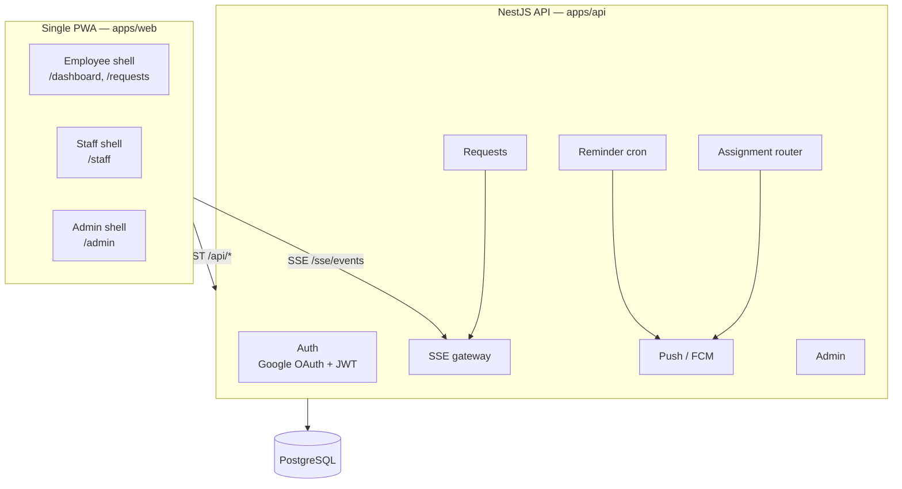
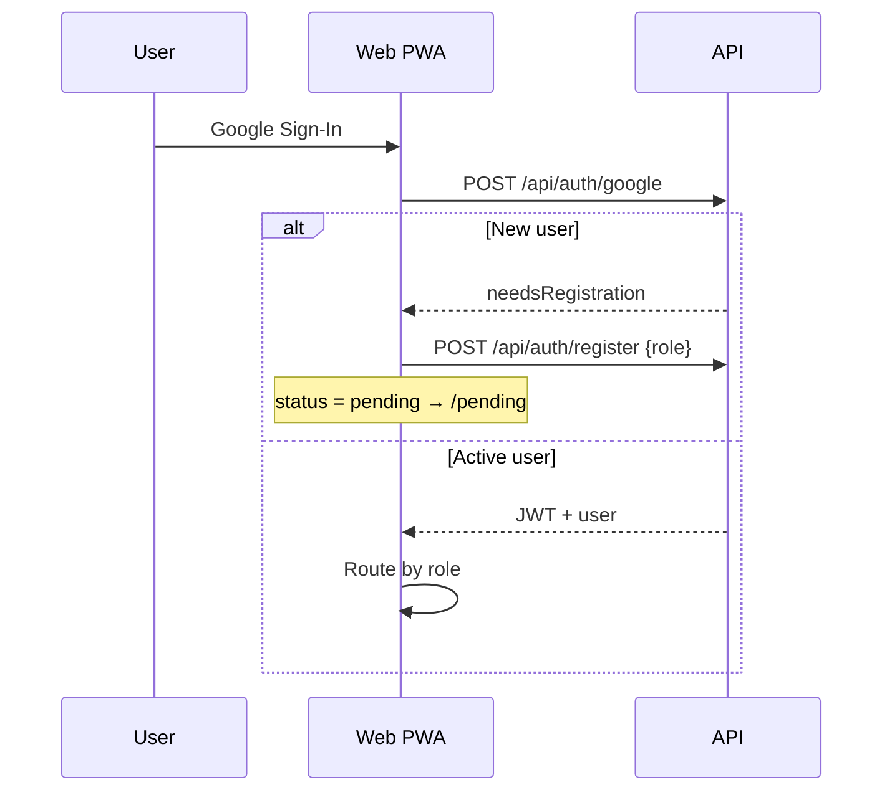
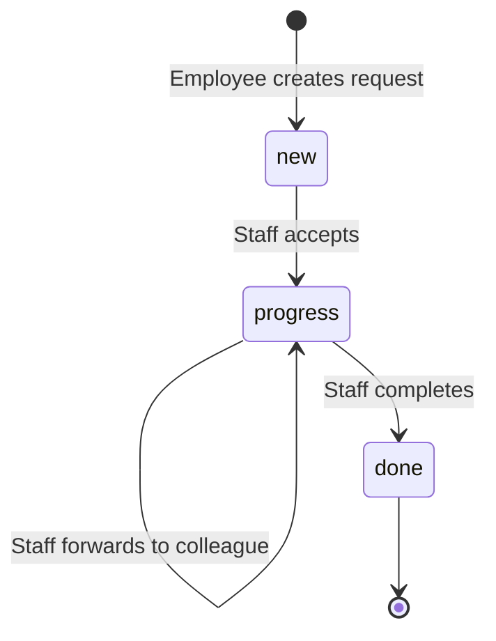

# QuestionPro Office Requests

An internal office help-request PWA. Employees raise requests (tea, snacks, supplies, printer/IT, assistance); office staff receive instant push notifications and in-app cards, then accept, forward, or complete them. Employees watch live status updates (Sent → Accepted → Completed).

| Shell | Users | UI language |
|-------|-------|-------------|
| **Employee** | Approved employees | English-first |
| **Staff** | Approved office helpers (2–3) | Bangla-first with English subtitles |
| **Admin** | Bootstrap + promoted admins | Approval queue + staff profile setup |

---

## Quick start

**Prerequisites:** Node.js 20+, pnpm 11+, Docker (for PostgreSQL).

```bash
pnpm install
cp .env.example .env          # fill in Google OAuth + JWT secrets (see below)
pnpm db:up                    # start Postgres in Docker
pnpm db:migrate               # apply Prisma migrations
pnpm dev                      # shared + API (:3000) + web (:5173)
```

Open [http://localhost:5173](http://localhost:5173). The Vite dev server proxies `/api` and `/sse` to the API, so the app behaves as a single origin.

Verify the API is up:

```bash
curl http://localhost:3000/health
# → {"ok":true,"service":"office-requests-api"}
```

### Minimum `.env` for local dev

| Variable | Purpose |
|----------|---------|
| `GOOGLE_CLIENT_ID` / `GOOGLE_CLIENT_SECRET` | Google Sign-In (same client ID goes in `VITE_GOOGLE_CLIENT_ID`) |
| `JWT_SECRET` | Signs session tokens |
| `BOOTSTRAP_ADMIN_EMAILS` | Comma-separated emails that auto-become admin on first login |
| `DATABASE_URL` | Defaults work with `pnpm db:up` |

Push notifications, FCM, and email are optional for core flows. See [Environment variables](#environment-variables).

---

## Architecture



**Production:** NestJS serves the built PWA static assets from the same origin as the API (no CORS). Docker Compose runs Postgres + API + Caddy reverse proxy. See [Production](#production).

---

## Repository layout

pnpm workspace monorepo with three packages:

```
qpbd-office/
├── apps/
│   ├── api/                 # @office/api — NestJS 10 backend
│   │   ├── prisma/          # schema + migrations
│   │   └── src/
│   │       ├── auth/          # Google OAuth, JWT, registration
│   │       ├── users/         # user CRUD + mappers
│   │       ├── admin/         # pending queue, approve/reject
│   │       ├── staff/         # staff list, availability
│   │       ├── requests/      # create, accept, forward, complete
│   │       ├── assignment/    # routing logic (who gets push)
│   │       ├── sse/           # Server-Sent Events broadcast
│   │       ├── push/          # Web Push / FCM subscriptions
│   │       ├── reminders/     # cron for stale "New" tab items
│   │       └── email/         # optional Resend notifications
│   └── web/                 # @office/web — Vite + React 19 PWA
│       └── src/
│           ├── shells/        # role-specific UIs (lazy-loaded)
│           │   ├── employee/  # dashboard, create modal, all requests
│           │   ├── staff/       # Bangla tabs, cards, forward flow
│           │   └── admin/       # approval queue
│           ├── pages/           # login, register, pending
│           ├── components/      # shared UI (shadcn + Icon)
│           ├── context/         # AuthContext
│           ├── hooks/           # useSSE, usePushNotifications, …
│           └── lib/             # api client, request store, auth routes
├── packages/
│   └── shared/              # @office/shared — types + constants
│       └── src/
│           ├── types.ts         # User, Request, enums
│           ├── constants.ts     # LOCATIONS, TYPES, colors
│           ├── assignment.ts    # routing helpers
│           └── icons.ts         # icon name maps
├── docker-compose.yml         # dev Postgres only
├── docker-compose.prod.yml    # Postgres + API + Caddy
└── .env.example
```

### Where to start for common tasks

| Task | Start here |
|------|------------|
| Add a request type or location | `packages/shared/src/constants.ts` |
| Change API behavior | `apps/api/src/<module>/` |
| Employee UI | `apps/web/src/shells/employee/` |
| Staff UI (Bangla copy) | `apps/web/src/shells/staff/` |
| Admin approval flow | `apps/web/src/shells/admin/` + `apps/api/src/admin/` |
| Real-time updates | `apps/api/src/sse/` + `apps/web/src/hooks/useSSE.ts` |
| Push notifications | `apps/api/src/push/` + `apps/web/src/hooks/usePushNotifications.ts` |
| Design tokens / theme | `apps/web/src/index.css` (`@theme` block) |
| Icons | `apps/web/scripts/gen-icons.mjs` → `src/icons/material-symbols/` |
| DB schema | `apps/api/prisma/schema.prisma` |
| Routes & auth guards | `apps/web/src/router.tsx`, `src/lib/auth-routes.ts` |

---

## Auth & routing



| Role | Home route | Guard |
|------|------------|-------|
| Employee | `/dashboard` | `RequireAuth roles=["employee"]` |
| Staff | `/staff` | `RequireAuth roles=["staff"]` |
| Admin | `/admin` | `RequireAuth roles=["admin"]` |
| Pending | `/pending` | Any authenticated, non-active user |

First admin: add your Google email to `BOOTSTRAP_ADMIN_EMAILS` in `.env`. That account is created as admin on first sign-in — no approval needed.

---

## Request lifecycle



1. **Create** — employee picks type, location, urgency, note → assignment router picks a staff member → push + SSE broadcast.
2. **Accept** — staff claims the request → status becomes `progress`.
3. **Forward** — staff reassigns to another helper → push to target, SSE update.
4. **Complete** — staff marks done → employee sees completion in real time.

Staff UI tabs map to status: **New** (`new`), **In progress** (`progress`), **Done** (`done`).

---

## API reference

All REST endpoints are prefixed with `/api`. SSE lives at `/sse/events` (no `/api` prefix).

| Method | Endpoint | Purpose |
|--------|----------|---------|
| `GET` | `/health` | Health check (no prefix) |
| `POST` | `/api/auth/google` | Exchange Google token → JWT |
| `POST` | `/api/auth/register` | `{ role: "employee" \| "staff" }` → pending |
| `GET` | `/api/auth/me` | Current user |
| `GET` | `/api/requests` | List requests (filtered by role) |
| `POST` | `/api/requests` | Create request |
| `POST` | `/api/requests/:id/accept` | Accept / claim |
| `POST` | `/api/requests/:id/forward` | `{ targetStaffId }` |
| `POST` | `/api/requests/:id/complete` | Mark done |
| `GET` | `/api/staff` | Staff roster |
| `PATCH` | `/api/staff/availability` | `{ status: available \| busy \| away }` |
| `GET` | `/api/admin/pending` | Approval queue |
| `POST` | `/api/admin/approve/:userId` | Approve (+ Bangla name for staff) |
| `POST` | `/api/admin/reject/:userId` | Reject |
| `POST` | `/api/push/subscribe` | Save Web Push subscription |
| `GET` | `/sse/events` | SSE stream (JWT via query) |

**SSE event types:** `request.created`, `request.updated`, `availability.changed`, `user.approved`

---

## Commands

Run from the repo root unless noted.

| Command | Description |
|---------|-------------|
| `pnpm install` | Install all workspace dependencies |
| `pnpm dev` | Build shared, then run shared watch + API + web concurrently |
| `pnpm build` | Production build: shared → api → web |
| `pnpm build:shared` | Rebuild `@office/shared` only (required after editing it) |
| `pnpm db:up` | Start Postgres container |
| `pnpm db:down` | Stop Postgres container |
| `pnpm db:migrate` | Run Prisma migrations |
| `pnpm db:generate` | Regenerate Prisma client |
| `pnpm test:shared` | Run shared package unit tests |
| `pnpm docker:prod` | Build and start production stack |
| `pnpm docker:prod:down` | Stop production stack |

**Per-package scripts** (examples):

```bash
pnpm --filter @office/web dev
pnpm --filter @office/api dev
pnpm --filter @office/shared test
```

---

## Environment variables

Copy `.env.example` to `.env`. Key groups:

| Group | Variables | Notes |
|-------|-----------|-------|
| Auth | `GOOGLE_CLIENT_ID`, `GOOGLE_CLIENT_SECRET`, `JWT_SECRET`, `JWT_EXPIRES_IN`, `BOOTSTRAP_ADMIN_EMAILS` | Required for sign-in |
| Database | `DATABASE_URL`, `POSTGRES_*`, `POSTGRES_PORT` | Dev defaults match `docker-compose.yml` |
| Push | `VAPID_*`, `FCM_PROJECT_ID`, `GOOGLE_APPLICATION_CREDENTIALS`, `VITE_VAPID_PUBLIC_KEY` | Optional locally; needed for real push |
| Reminders | `STAFF_REMINDER_INTERVAL_MINUTES`, `STAFF_REMINDER_ENABLED` | Cron nudges for stale New-tab items |
| App | `APP_URL`, `APP_DOMAIN`, `API_PORT`, `VITE_GOOGLE_CLIENT_ID` | `APP_URL` must be HTTPS in production |
| Email | `RESEND_API_KEY`, `RESEND_FROM` | Optional approval notification |

Generate VAPID keys: `npx web-push generate-vapid-keys`

---

## Conventions

### `@office/shared`

Single source of truth for domain types, enums, `LOCATIONS`, `TYPES`, availability colors, staff brand palette, and icon name maps. Both apps import from here.

- Emits **ESM** — internal imports must use explicit `.js` extensions (`export * from "./types.js"`).
- After any change, rebuild: `pnpm build:shared` (or keep `pnpm dev` running — it watches shared).

### Frontend

- **Design tokens** in `apps/web/src/index.css` (`@theme`). Use Tailwind semantic names (`bg-primary`, `text-lead`) — do not hardcode hex in components.
- **Icons:** tree-shaken Material Symbols via `<Icon name="…"/>` and `<TypeIcon type="…"/>`. Add glyphs in `apps/web/scripts/gen-icons.mjs`, then re-run the script.
- **Fonts:** Fira Sans (Latin) + Noto Sans Bengali fallback in `--font-sans`. Required for staff Bangla UI.

### Backend

- Prisma for DB access (`apps/api/prisma/`).
- Global validation pipe whitelists DTO fields.
- Production serves the built PWA from `apps/api/public/` for single-origin deployment.

---

## Production

```bash
pnpm build
pnpm docker:prod        # Postgres + API + Caddy (ports 80/443)
```

Set `APP_DOMAIN` and HTTPS in `.env`. Caddy config lives in `deploy/Caddyfile`. The API Dockerfile bundles the web build into the same container.

---

## Troubleshooting

### Port already in use

`pnpm dev` runs `predev` which kills processes on ports 3000, 5173, and 5174. If that fails:

```bash
pnpm dev:kill
```

### Postgres port conflict

If local Postgres occupies 5432, set `POSTGRES_PORT=5433` (or another free port) in `.env`. Docker maps `${POSTGRES_PORT}:5432`.

### Shared types out of date

Symptoms: TypeScript errors in web/api after editing shared. Fix:

```bash
pnpm build:shared
```

### Google Sign-In fails locally

Ensure `GOOGLE_CLIENT_ID` is set in both `.env` and reaches Vite via `VITE_GOOGLE_CLIENT_ID`. Add `http://localhost:5173` to authorized JavaScript origins in Google Cloud Console.

### Push not working in dev

Web Push requires HTTPS or localhost. Configure VAPID keys and, for FCM, place a Firebase service account at the path in `GOOGLE_APPLICATION_CREDENTIALS`.

---

## Contributing

Work is tracked as GitHub issues on `khairul-anik-qp/qpbd-office`. Branch naming: `phase-N/issue-M-slug` off `main`. Commit with `Closes #M` in the message body, open a PR, squash-merge.

Agent/dev guidance for this repo also lives in `CLAUDE.md`.
